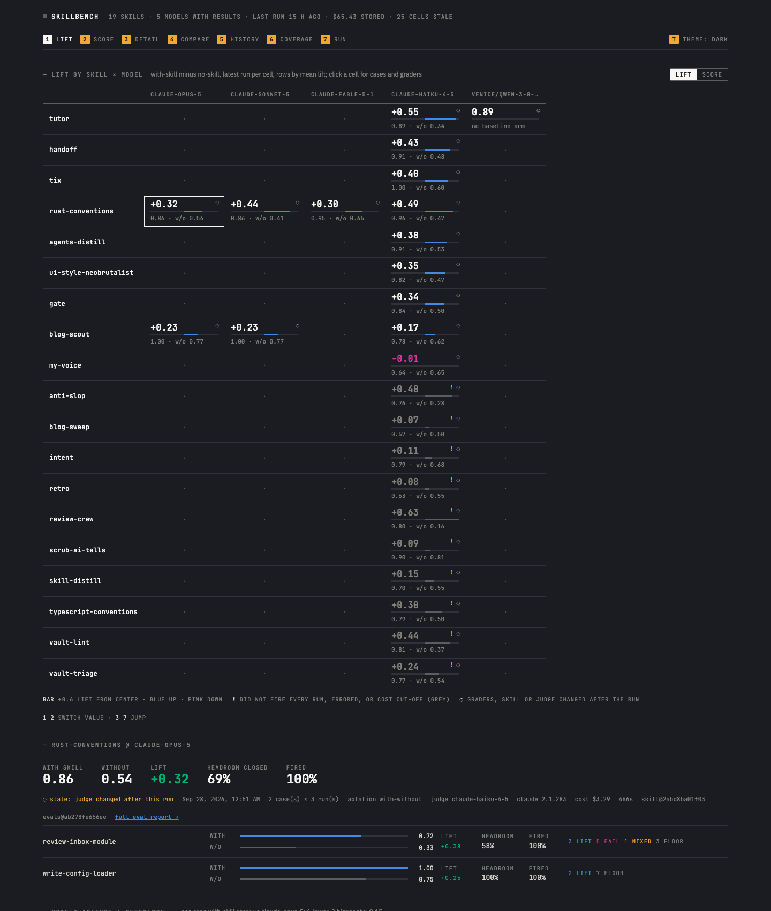

# skillbench

Measure what your agent skills actually add, per model, and see it move when a new model ships.



A skill is a prompt the model reads before it works. The only honest question about one is:
**does the model do the job better with it than without it?** `claude plugin eval` (Claude Code
2.1.269 and later) can answer that for a single run: it loads a skill into a sandboxed
`claude -p` session, runs prompt cases, grades them with deterministic and LLM graders, and
repeats each case with the skill absent. skillbench is the loop around it, so the answer is
kept, compared across models, and re-asked when anything changes:

- **discover** skills that ship eval cases, in their own repos or as overlays here;
- **run** the same suites against any list of models, Claude directly or anything with an
  OpenAI-compatible API through a private proxy;
- **store** every result append-only, fingerprinted by the skill's content, its graders and
  the judge, so a score change can be attributed;
- **read** a lift matrix (with-skill minus no-skill), the share of headroom each skill
  closes, whether it even fired, and which cells are no longer trustworthy.

Stdlib-only Python. No runtime dependencies.

## Quick start

```sh
git clone https://github.com/fielding/skillbench && cd skillbench
uv sync --extra dev
cp skillbench.example.toml skillbench.toml     # point `roots` at your skills
uv run skillbench doctor                        # claude version, login, roots, grant mismatches
uv run skillbench list                          # every skill under the roots and its case count
uv run skillbench run -m claude-haiku-4-5 -s <skill> --runs 1   # cheap smoke run
uv run skillbench dashboard --open              # self-contained results/dashboard.html
uv run skillbench serve --open                  # the live version, can launch runs
```

`run --dry-run` prints the exact `claude plugin eval` commands. `run -m <model>` runs every
skill on one model; `run` with no filters runs the whole matrix and refuses above 40 cells
unless you pass `--all`.

## What the numbers mean

Every case runs `--runs` times with the skill loaded and the same number without it, on the
same model, same prompt, same graders. From that:

- **score** is the mean grader pass rate with the skill (0 to 1). **without** is the same for
  the bare model.
- **lift** is the difference. It is the number to read first: a skill with a high score and
  no lift is a skill the model did not need. A negative lift is a skill that makes the model
  worse, and those exist.
- **headroom closed** is lift divided by the gap the bare model left. Strong models leave
  little headroom, so +0.19 on a 0.81 baseline is the whole gap, not a weak result.
- **fired** is the share of with-skill runs where the skill was actually invoked. Below 100%
  the cell is partly measuring the bare model, and the dashboard greys it out.
- A grader that passes in both arms is a **floor** (the bare model already does it); one that
  passes only with the skill is the **lift**; one that fails with the skill is either a
  rubric problem or a real finding. The detail view classes every grader this way.

Scores are noisy. Three runs per case per arm is the default; treat a single run as a pipeline
check, not a verdict.

## When something changes

`skillbench list --stale` compares every stored cell with the world as it is now and prints
the re-run commands:

```
stale cells (skill or graders edited after the newest run):
  claude-opus-5            rust-conventions         2026-09-28T05-51-28Z  judge changed
  claude-haiku-4-5         scrub-ai-tells           2026-09-27T04-10-07Z  graders changed

2 of 26 cell(s) stale; re-run:
  uv run skillbench run -m claude-opus-5 -s rust-conventions
  uv run skillbench run -m claude-haiku-4-5 -s scrub-ai-tells
```

A cell is stale when the skill's content, its assembled graders, or the judge model differ
from what produced it. The dashboard marks the same cells with `◌`. When a new model ships,
add it to `models` and `run -m <new-model>`; the "models against a reference" section lists
per-case changes against whichever model you pick.

## Dashboard

`skillbench dashboard` writes one HTML file with the results embedded, so it works offline;
`skillbench serve` is the live version with a run form. It leads with the lift matrix, rows
sorted by mean lift: the big number is the lift, the bar grows from center (blue up, pink
down), the small line is both scores. Grey with `!` means the cell should not be read yet
(the skill did not fire every run, a run errored, or the cost ceiling cut it short); hover for
why. Clicking a cell opens the detail: with, without, lift, headroom closed, fired, then every
case with its graders and the judge's latest verdict and evidence. Comparison against a
reference model, run history (amber ticks mark a skill or grader edit between runs) and
coverage sit in folded sections. The key strip under the header works with the keyboard:
`1` and `2` switch the matrix between lift and score, `3` to `7` jump to sections, `t` cycles
the theme. `#skill@model` in the URL deep-links a cell.

## Models other than Claude

`claude -p` only speaks the Anthropic Messages API, so other providers run through a private
[CLIProxyAPI](https://github.com/router-for-me/CLIProxyAPI) instance that skillbench starts
and stops per run. Venice is known out of the box: install the proxy, export your key, run.

```sh
brew install cliproxyapi
export VENICE_API_KEY=…                       # from your Venice account's API keys page
uv run skillbench doctor                       # confirms the proxy binary and the key
uv run skillbench models venice                # the catalog, with tool-calling support per model
uv run skillbench run -m venice/kimi-k3 -s <skill>
```

Model ids take the provider prefix. Venice serves Claude as well, so the judge for `venice/…`
runs stays on Venice (`venice/claude-sonnet-4-5`) and no Anthropic key is needed. Any of the
defaults can be overridden per field, and other OpenAI-compatible providers are added the same
way:

```toml
[providers.venice]
api_key = "op://<vault>/<item>/credential"   # instead of env:VENICE_API_KEY; keychain:<service> also works

[providers.other]
base_url = "https://api.example.com/v1"
api_key = "env:OTHER_API_KEY"
judge_model = "other/some-strong-model"       # or set [proxy] judge_api_key to route a Claude judge

[proxy]
op_account = "<account>.1password.com"        # only for op:// references
# judge_api_key = "op://…"                     # route the configured Claude judge to Anthropic instead
```

Per run, skillbench resolves the key (env var, 1Password CLI or macOS Keychain), writes a
0600 proxy config under `build/proxy/`, starts the proxy on a free localhost port with a
random per-run token and the management API off, points the eval's `claude` children at it,
and deletes the config when the run ends. Two caveats, both recorded in `meta.json` and shown
in the dashboard: the judge differs from your Claude runs unless you route it, and Claude
Code's cost estimate assumes Claude pricing, so proxied runs are shown as unpriced and the
`max_cost_usd` ceiling does not apply to them unless you pass `--max-cost-usd` explicitly.

## Where cases live

`roots` lists where skills come from: a skill directory, a directory of skills, or a skills
store with symlinks (followed and de-duplicated). A skill's cases live in `<skill>/evals/`,
the layout `claude plugin eval init` produces, and travel with the skill. For a skill you
cannot edit, put cases in `suites/<skill>/evals/` here instead; both are merged at run time
and an overlay case with the same name wins. Each run builds `build/<skill>/` as a real
plugin (manifest, a copy of the skill, the merged `evals/`), because the eval command refuses
eval directories that symlink outside the plugin. Skill repos are never written to.

```
evals/<case>/
  case.yaml            # schema_version, name, execution.{prompt,max_turns,allowed_tools}, context.scaffold_script
  graders/*.md         # type: llm | regex | tool_used | tool_order | file_exists | baseline
  fixtures/            # files the case needs
  setup.sh             # copies fixtures/ into the sandbox cwd (needs scaffold = true for the skill)
```

`skillbench convert <skill>` turns two older formats into native cases: skill-creator
`evals/evals.json`, and `evals/*.eval.md`. It never overwrites an existing case without
`--force`, and `--overlay` writes into `suites/`.

### Things the sandbox does that will surprise you

- **Write, Edit, Bash, WebFetch and WebSearch are removed** unless the skill is granted them
  in `[skills.<name>] allow_tools`. `doctor` flags cases that ask for more than they get.
- **Fixture files are invisible** unless a scaffold script copies them into the working
  directory, and scaffold scripts only run with `[skills.<name>] scaffold = true`. They run
  unsandboxed, as you; only author them yourself.
- **A run is one turn.** The agent never hears back from the user, so grade the first reply
  on its own terms: a skill whose correct opening is a question or a consent request must be
  graded on that, and files it wrote are read with `focus: { source: file, path: … }`.
- A skill with `disable-model-invocation: true` never fires through the `Skill` tool; its
  prompts must start with the slash command and it cannot carry a `skill-fired` grader. The
  subagent tool is named `Task` in traces, so assert `Task|Agent` with a trace regex.
- `focus: trace` LLM graders see only the first and last 12 messages of a session.
- On macOS since Claude Code 2.1.282 the sandbox denies the cache write Apple's `/usr/bin/git`
  shim needs, and PATH additions are invisible inside it. Put a real git first on PATH once:
  `ln -s /Library/Developer/CommandLineTools/usr/bin/git /opt/homebrew/bin/git`.

## Writing cases that measure the skill

Four tests a case has to pass, in order:

1. **In lane.** The prompt is something a user would type, the skill is supposed to handle
   it, and the skill actually fires.
2. **Planted truth.** The fixture carries specific facts or defects (a hardcoded key, a
   failing test, a ruling attributed to a named reviewer) and the graders check for those.
3. **Skill-shaped.** Every grader traces to a sentence in the skill. If you cannot quote the
   sentence a grader enforces, it is measuring the model.
4. **Discriminating.** A capable model without the skill should fail at least one core
   grader. Otherwise the case is a regression guard, useful but not a measure of the skill.

Grader hygiene underneath: deterministic graders (`file_exists`, `regex` on a written file)
wherever the skill produces an artifact; `llm` only for judgment, and then **one assertion
per grader**, because a small judge fails "PASS if all of (a) to (e)" rubrics for the wrong
reasons; negative-space guards (`no-push`, `no-edit`) scored in both arms so a skill that does
the wrong thing loses points even when it also does the right thing.

Then calibrate: run the suite once on a cheap model, open every grader verdict in the
dashboard, and class them. A grader passing in both arms is a floor or a guard; one failing
with the skill is a rubric problem if the output met the bar and a finding if it did not.
Two-one judge splits across runs mean the rubric is vague; `max_turns` errors mean the case
is too big for one turn. Use a Sonnet-class judge before comparing across models: a Haiku
judge was observed failing correct, long answers from stronger models. A full worked audit of
one author's 39 cases is in [docs/eval-audit.md](docs/eval-audit.md).

## Cost

Each case run is a full `claude -p` session. Deterministic graders are free; `llm` graders
add three judge votes each. `max_cost_usd` caps every (skill, model) invocation and marks the
run `partial` if it hits the cap. `--ablation none --runs 1` is the cheap mode for iterating
on cases.

## Limits

- The executor is Claude Code's `claude -p`, so the agent side is always Claude Code, even
  when the model behind it is not Claude.
- `claude plugin eval` is marked experimental upstream; its JSON is `schemaVersion: 1`.
  `report.py` and `tests/fixtures/*.json` are where to start if it changes.
- Fonts on the dashboard come from Google Fonts and fall back to the system mono and sans
  offline.

## License

MIT.
